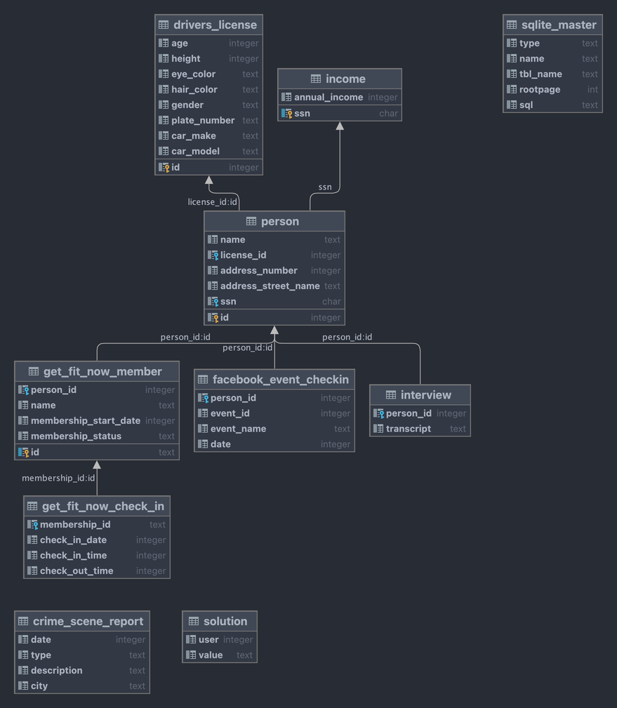

# 


## Contexte : 
Nous avons besoin de votre aide pour résoudre une enquête criminelle. Un crime a été commis à SQL City le 15 janvier 2018, et nous avons perdu le rapport de la scène de crime. Votre mission consiste à récupérer ce rapport à partir de la base de données du département de police. Nous avons affaire à un meurtre et votre travail est essentiel pour faire progresser notre enquête. Nous comptons sur votre expertise en SQL pour nous aider à retrouver les informations nécessaires à la résolution de cette affaire. Bonne chance dans cette mission cruciale.

## Instructions :
1. Importer la base de données du département de police dans votre environnement de travail.
2. Comprendre la strucuration de la base de données.
3. Quels sont les types de données ? 
* Est ce que tous les types de données sont corrects ? (i.e. les dates sont-elles au bon format ?)
* Est ce que les données est propres ? 

## Aide pour commencer :
Voici une première requête pour vous aider à comprendre la structure de la base de données :
```sql
select * from crime_scene_report where city = 'SQL City' AND date = 20180115
```
### Diagramme de la base de données :




TP crée par [knight lab](https://mystery.knightlab.com)
**On ne regarde pas les solutions avant d'avoir essayé de résoudre le TP**